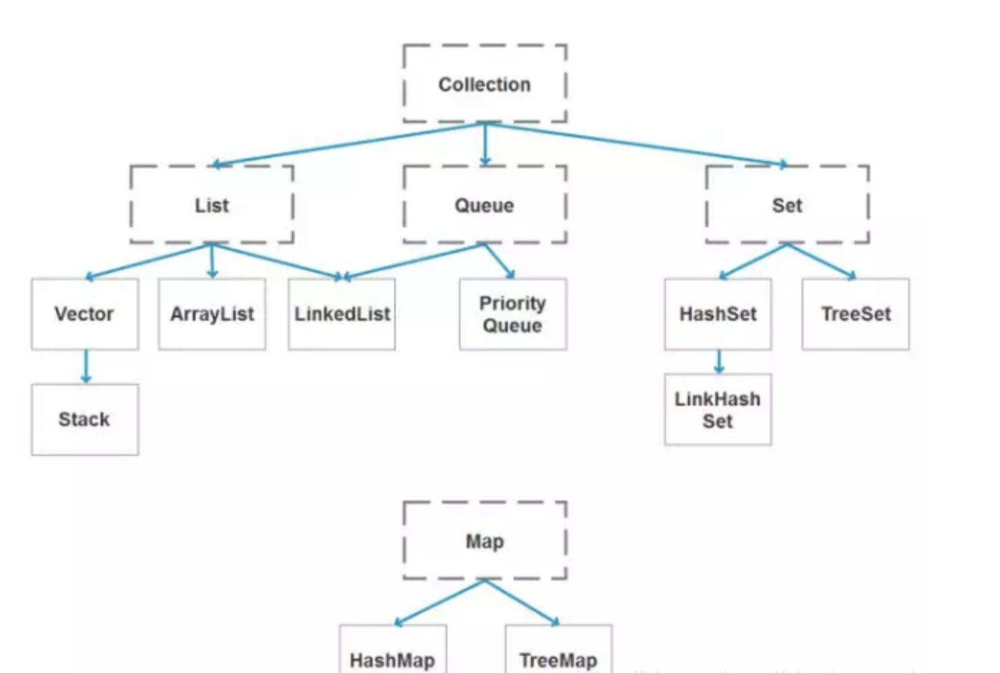
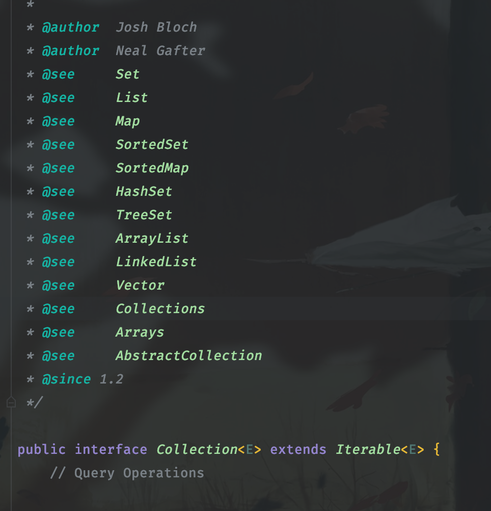
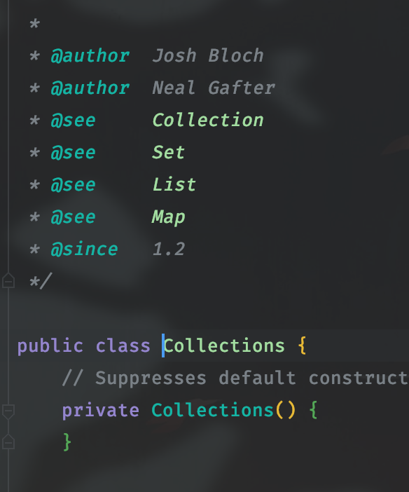
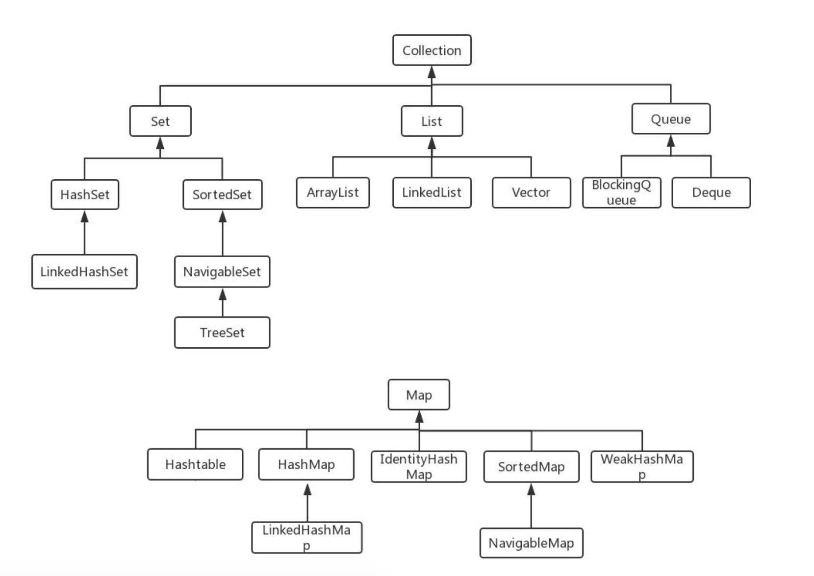

# 容器集合
[题目转载地址跳转](https://blog.csdn.net/fangchao2011/article/details/89203535)

## 容器汇总图
  
## Collection 和 Collections 有什么区别？
1.Collection是集合体系的最顶层，包含了集合体系的共性
   
  
   
  Collections是一个工具类，方法都是用于操作Collection
   
  

## List、Set、Map 之间的区别是什么？
 List：有序集合，元素可重复 
  
 Set：不重复集合，LinkedHashSet按照插入排序，SortedSet可排序，HashSet无序
  
 Map：键值对集合，存储键、值和之间的映射；Key无序，唯一；value 不要求有序，允许重复
  
  

## HashMap 和 Hashtable 有什么区别？
1.HashMap是非线程安全 Hashtable是线程安全 Hashtable的实现方面里面都添加了synchronized关键字来确保线程同步。 
在多线程环境下若使用HashMap需要使用Collections.synchronizedMap() 
2.HashMap可以使用null作为key，不过建议还是尽量避免这样使用。HashMap以null作为key时，总是存储在table数组的第一个节点上。 
而Hashtable则不允许null作为key 
3.HashMap继承了AbstractMap，HashTable继承Dictionary抽象类，两者均实现Map接口。 
4.HashMap的初始容量为16，Hashtable初始容量为11，两者的填充因子默认都是0.75。 
5.HashMap扩容时是当前容量翻倍即:capacity*2，Hashtable扩容时是容量翻倍+1即:capacity*2+1。 
6.HashMap和Hashtable的底层实现都是数组+链表结构实现。 
7.Hashtable计算hash是直接使用key的hashcode对table数组的长度直接进行取模 
HashMap计算hash对key的hashcode进行了二次hash，以获得更好的散列值，然后对table数组长度取摸 
8.在HashMap 中，null 可以作为键，这样的键只有一个；可以有一个或多个键所对
应的值为null。当get()方法返回null 值时，既可以表示HashMap 中没有该键，也可
以表示该键所对应的值为null。因此，在HashMap 中不能用get()方法来判断HashMap 中是否存在某个键，而应该用containsKey()方法来判断。Hashtable 的键值都不能
为null，所以可以用get()方法来判断是否含有某个键。
[转载地址](https://blog.csdn.net/qq_35181209/article/details/74503362?utm_medium=distribute.pc_relevant.none-task-blog-BlogCommendFromMachineLearnPai2-2.control&depth_1-utm_source=distribute.pc_relevant.none-task-blog-BlogCommendFromMachineLearnPai2-2.control)

## 如何决定使用 HashMap 还是 TreeMap？
#### 介绍
TreeMap<K,V>的Key值是要求实现java.lang.Comparable，所以迭代的时候TreeMap默认是按照Key值升序排序的；TreeMap的实现是基于红黑树结构。适用于按自然顺序或自定义顺序遍历键（key）。 
HashMap<K,V>的Key值实现散列hashCode()，分布是散列的、均匀的，不支持排序；数据结构主要是桶(数组)，链表或红黑树。适用于在Map中插入、删除和定位元素。 
#### 结论
如果你需要得到一个有序的结果时就应该使用TreeMap（因为HashMap中元素的排列顺序是不固定的）。除此之外，由于HashMap有更好的性能，所以大多不需要排序的时候我们会使用HashMap。 
#### 拓展
1、HashMap 和 TreeMap 的实现

HashMap：基于哈希表实现。使用HashMap要求添加的键类明确定义了hashCode()和equals()[可以重写hashCode()和equals()]，为了优化HashMap空间的使用，您可以调优初始容量和负载因子。

HashMap(): 构建一个空的哈希映像
HashMap(Map m): 构建一个哈希映像，并且添加映像m的所有映射
HashMap(int initialCapacity): 构建一个拥有特定容量的空的哈希映像
HashMap(int initialCapacity, float loadFactor): 构建一个拥有特定容量和加载因子的空的哈希映像
TreeMap：基于红黑树实现。TreeMap没有调优选项，因为该树总处于平衡状态。

TreeMap()：构建一个空的映像树
TreeMap(Map m): 构建一个映像树，并且添加映像m中所有元素
TreeMap(Comparator c): 构建一个映像树，并且使用特定的比较器对关键字进行排序
TreeMap(SortedMap s): 构建一个映像树，添加映像树s中所有映射，并且使用与有序映像s相同的比较器排序
2、HashMap 和 TreeMap 都是非线程安全

HashMap继承AbstractMap抽象类，TreeMap继承自SortedMap接口。

AbstractMap抽象类：覆盖了equals()和hashCode()方法以确保两个相等映射返回相同的哈希码。如果两个映射大小相等、包含同样的键且每个键在这两个映射中对应的值都相同，则这两个映射相等。映射的哈希码是映射元素哈希码的总和，其中每个元素是Map.Entry接口的一个实现。因此，不论映射内部顺序如何，两个相等映射会报告相同的哈希码。

SortedMap接口：它用来保持键的有序顺序。SortedMap接口为映像的视图(子集)，包括两个端点提供了访问方法。除了排序是作用于映射的键以外，处理SortedMap和处理SortedSet一样。添加到SortedMap实现类的元素必须实现Comparable接口，否则您必须给它的构造函数提供一个Comparator接口的实现。TreeMap类是它的唯一一个实现。

3、TreeMap中默认是按照升序进行排序的，如何让他降序

通过自定义的比较器来实现

定义一个比较器类，实现Comparator接口，重写compare方法，有两个参数，这两个参数通过调用compareTo进行比较，而compareTo默认规则是：

如果参数字符串等于此字符串，则返回 0 值； 
如果此字符串小于字符串参数，则返回一个小于 0 的值； 
如果此字符串大于字符串参数，则返回一个大于 0 的值。 
[转载地址](https://www.cnblogs.com/javazhiyin/p/11652526.html)

## 说一下 HashMap 的实现原理？

## 说一下 HashSet 的实现原理？

## ArrayList 和 LinkedList 的区别是什么？

## 如何实现数组和 List 之间的转换？

## ArrayList 和 Vector 的区别是什么？

## Array 和 ArrayList 有何区别？

## 在 Queue 中 poll()和 remove()有什么区别？

## 哪些集合类是线程安全的？

## 迭代器 Iterator 是什么？

## Iterator 怎么使用？有什么特点？

## Iterator 和 ListIterator 有什么区别？

